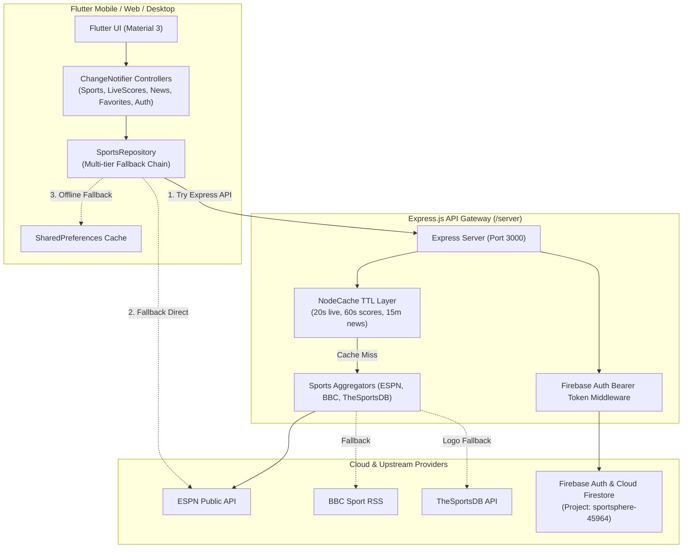

# ⚽ SportSphere — Real-Time Sports & Live Scores Platform

**SportSphere** is a cross-platform live sports tracking application built with **Flutter**, backed by a high-performance **Express.js (Node.js)** API gateway and **Firebase** (Authentication & Cloud Firestore).

---

## 🌟 Key Features

- **⚡ Real-Time Live Scores**: Live score tracking across **Premier League (EPL)**, **UEFA Champions League**, **NBA**, and **NFL** with 45-second polling and automatic lifecycle-aware pause/resume when backgrounded.
- **📅 Dynamic Schedule**: 7-day horizontal date selector (−2 to +4 days) with league filters and full match metadata.
- **📰 Curated Sports News**: ESPN news aggregator with dynamic category chips, full article details, and automated **BBC Sport RSS** fallback.
- **🔍 Match & Team Details**: Real-time match timelines, scoring summaries, key event clocks, team fixtures, and **TheSportsDB** badge fallback.
- **❤️ Favorites & Cloud Sync**: Follow teams during onboarding or from match cards. Favorites synchronize in real-time across devices using **Cloud Firestore**.
- **🔐 Firebase Authentication**: Complete email/password sign-in, registration, and guest mode with account management bottom sheet.
- **🚀 Server-Side TTL Caching**: Express backend caches upstream API calls in-memory (20s–15m TTL), cutting external rate limits and response payloads by up to 90%.
- **📱 Material 3 Design**: Clean Figma design tokens (`#0B6E4F` Primary, `#FF6B35` Secondary, `#D32F2F` Live indicator) with smooth `IndexedStack` tab persistence.

---

## 🏗️ Architecture



---

## 📂 Project Structure

```
sportsphere_flutter_complete/
├── server/                            # Node.js / Express.js Backend
│   ├── src/
│   │   ├── config/                    # Environment & Firebase Admin config
│   │   ├── controllers/               # Route handlers (scores, news, matches, teams, favorites)
│   │   ├── middleware/                # Auth token verification & global error handling
│   │   ├── routes/                    # Express route definitions (/api/v1/*)
│   │   ├── services/                  # ESPN API, BBC RSS, TheSportsDB, and NodeCache
│   │   ├── app.js                     # Express app setup & middleware
│   │   └── server.js                  # Server entry point
│   ├── test/                          # Automated Node.js API tests
│   ├── package.json                   # "type": "module" (ES Modules)
│   └── .env                           # Server environment variables
├── lib/                               # Flutter Frontend App
│   ├── models/                        # Data models (SportMatch, Team, NewsArticle, SportLeague)
│   ├── repositories/                  # SportsRepository with fallback chains
│   ├── screens/                       # UI screens (Home, Schedule, LiveScores, News, Favorites, MatchDetail, TeamDetail, Auth, Splash, Onboarding)
│   ├── services/                      # ApiService, EspnService, CacheService, FirestoreService
│   ├── state/                         # State controllers (SportsController, LiveScoresController, NewsController, FavoritesController, AuthController)
│   ├── theme/                         # Material 3 theme & Figma design tokens
│   ├── widgets/                       # Reusable UI components (MatchCard, NewsCard, TeamBadge, StatusBadge, FilterChipRow, AccountSheet)
│   ├── firebase_options.dart          # Generated Firebase configuration
│   └── main.dart                      # App entry point with _HomeShell (IndexedStack)
├── test/                              # Flutter unit and widget tests
└── pubspec.yaml                       # Flutter dependencies
```

---

## 🚀 Getting Started

### Prerequisites
- **Flutter SDK**: `>=3.3.0 <4.0.0`
- **Node.js**: `>=18.0.0` and **npm**

---

### 1. Start the Express Backend

In a terminal, run:

```bash
cd server
npm install
npm run dev
```

The server will start on `http://localhost:3000`:
- **API Base**: `http://localhost:3000/api/v1`
- **Health Check**: `http://localhost:3000/api/v1/health`

---

### 2. Start the Flutter App

In a separate terminal, run:

```bash
# Get Flutter packages
flutter pub get

# Run on macOS / Chrome / iOS Simulator / Android Emulator
flutter run
```

> **Note for Android Emulator**: The Flutter `ApiService` automatically detects Android and connects to `http://10.0.2.2:3000/api/v1`. On macOS, iOS, and Web, it connects to `http://localhost:3000/api/v1`.

---

## 📡 REST API Endpoints

| Method | Endpoint | Description | Auth Required | Cache TTL |
|--------|----------|-------------|---------------|-----------|
| `GET` | `/api/v1/health` | Service health status | No | None |
| `GET` | `/api/v1/scores?league=soccer/eng.1` | League scoreboard & schedule | No | 60s / 10m |
| `GET` | `/api/v1/scores/live` | Active live matches across leagues | No | 20s |
| `GET` | `/api/v1/news?league=soccer/eng.1` | Sports news with BBC fallback | No | 15m |
| `GET` | `/api/v1/matches/:league/:eventId/summary` | Match summary & timeline events | No | 30s |
| `GET` | `/api/v1/teams/popular` | Popular teams catalog with logos | No | 1 hour |
| `GET` | `/api/v1/teams/:teamId/matches` | Team fixtures & results | No | 2m |
| `GET` | `/api/v1/favorites` | Get user's cloud favorites | Yes (Bearer Token) | None |
| `POST` | `/api/v1/favorites` | Save/update favorite team | Yes (Bearer Token) | None |
| `DELETE` | `/api/v1/favorites/:teamId` | Remove favorite team | Yes (Bearer Token) | None |

---

## 🧪 Running Automated Tests

### Flutter Tests & Static Analysis
```bash
# Static analysis (0 warnings, 0 errors)
flutter analyze

# Run Flutter test suite (13 passing test suites)
flutter test
```

### Express Backend Tests
```bash
cd server
npm test
```

---

## 🎨 Figma Design Tokens

| Token | Hex | Usage |
|-------|-----|-------|
| Primary | `#0B6E4F` | Main brand green, active chips, primary buttons |
| Pale Green | `#E8F5E9` | Badges, card backgrounds, avatars |
| Secondary | `#FF6B35` | Accents |
| Live | `#D32F2F` | Live indicators, errors |
| Background | `#F5F7F6` | Screen background |
| Surface | `#FFFFFF` | Cards, app bars, sheets |
| Outline | `#C4C9C6` | Borders, unselected states |
