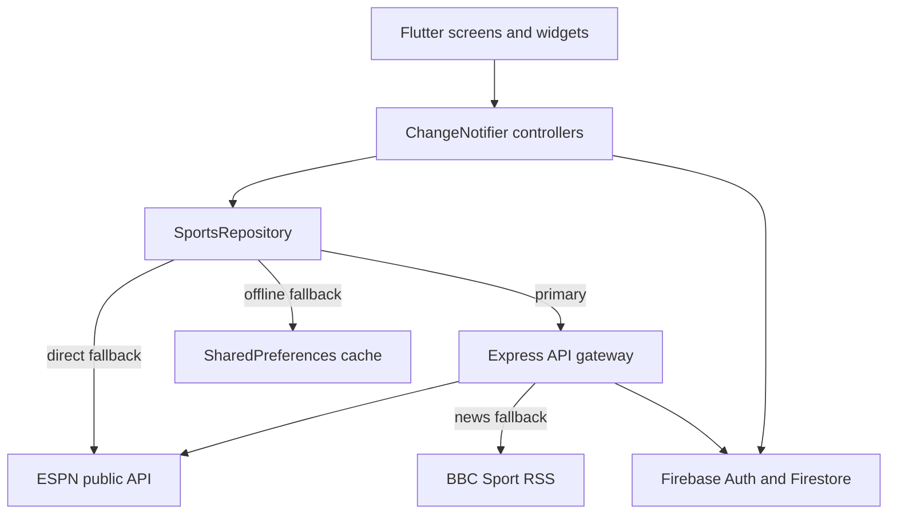

# SportSphere

SportSphere is a cross-platform Flutter sports app for browsing scores, schedules, news, match details, teams, and favorites. It uses an Express.js API gateway for aggregated sports data and Firebase Authentication/Cloud Firestore for account and favorite-team synchronization.

## Features

- Live scores for the Premier League, UEFA Champions League, NBA, and NFL.
- 45-second live-score polling with pause/resume when the app is backgrounded.
- Schedule browsing with date selection and league filtering.
- Sports news with league/category filters, article details, and BBC Sport RSS fallback.
- Match summaries, timelines, team details, fixtures, and team-logo fallbacks.
- Local favorite-team storage with optional Firestore synchronization for signed-in users.
- Email/password authentication, anonymous guest access, and account management.
- Light, dark, and system theme modes.
- Offline-friendly repository fallback to cached or bundled mock data.

## Architecture



The Flutter repository tries the local Express API first, then direct ESPN requests, and finally local cached/mock data. The backend adds upstream aggregation, CORS/security middleware, and in-memory TTL caching. Firebase is used for authentication and favorites; public score and news endpoints do not require a user token.

## Project Structure

```text
lib/
  models/          Domain models for matches, leagues, teams, and articles
  repositories/    Data access and fallback orchestration
  screens/         Splash, onboarding, home, schedule, live, news, details, and settings
  services/        Express API, ESPN, cache, and Firestore integrations
  state/           ChangeNotifier controllers for app state
  theme/           Material 3 themes and design tokens
  widgets/         Shared navigation and UI components
  main.dart        Firebase initialization and application routing
server/
  src/app.js       Express middleware and route registration
  src/server.js    Development/production server entrypoint
  src/config/      Environment and Firebase Admin configuration
  src/controllers/ API request handlers
  src/middleware/  Authentication and error middleware
  src/routes/      Versioned API routes
  src/services/    ESPN, BBC, TheSportsDB, and cache integrations
  test/            Node.js API tests
test/              Flutter unit and widget tests
assets/            Mock JSON, images, and SVG assets
```

## Requirements

- Flutter SDK with Dart `>=3.3.0 <4.0.0`.
- Node.js 18 or newer and npm.
- A configured Firebase project for email authentication and cloud favorites. The checked-in `lib/firebase_options.dart` contains the client configuration used by Flutter.

## Getting Started

### Start the backend

From the repository root:

```bash
cd server
npm install
npm run dev
```

The API listens on `http://localhost:3000` by default. Use `npm start` for a normal Node.js process. The health endpoint is:

```text
http://localhost:3000/api/v1/health
```

The backend reads an optional `server/.env` file. Supported values include:

```env
PORT=3000
NODE_ENV=development
FIREBASE_PROJECT_ID=sportsphere-45964
CORS_ORIGIN=*
API_SPORTS_KEY=optional_api_sports_key
```

`API_SPORTS_KEY` is optional and must remain server-side. The backend falls back to ESPN when API-Sports is not configured or a request fails. Do not commit `server/.env` or credentials.

### Run the Flutter app

From the repository root, in a second terminal:

```bash
flutter pub get
flutter run
```

The default API URL is selected by platform:

| Platform | API URL |
| --- | --- |
| Web, macOS, iOS, and other desktop platforms | `http://localhost:3000/api/v1` |
| Android emulator | `http://10.0.2.2:3000/api/v1` |

Start the backend before launching the app if you want live server data. If the backend or upstream providers are unavailable, the repository uses direct ESPN access and then saved/mock data where available.

## API

All routes are prefixed with `/api/v1`.

| Method | Endpoint | Purpose | Auth |
| --- | --- | --- | --- |
| GET | `/health` | Service health | None |
| GET | `/scores?league=soccer/eng.1` | League scoreboard or schedule | None |
| GET | `/scores/live` | Live matches across supported leagues | None |
| GET | `/news?league=soccer/eng.1` | News feed with fallback aggregation | None |
| GET | `/matches/:league/:eventId/summary` | Match summary and timeline | None |
| GET | `/teams/popular` | Popular teams catalog | None |
| GET | `/teams/:teamId/matches` | Team fixtures and results | None |
| GET | `/favorites` | Read a user's cloud favorites | Firebase Bearer token |
| POST | `/favorites` | Save or update a favorite team | Firebase Bearer token |
| DELETE | `/favorites/:teamId` | Remove a favorite team | Firebase Bearer token |

League keys are `soccer/eng.1`, `soccer/uefa.champions`, `basketball/nba`, and `football/nfl`. The API also accepts the football shorthand `eng.1` and normalizes it to `soccer/eng.1`.

## Testing and Analysis

```bash
# Flutter static analysis and tests
flutter analyze
flutter test

# Backend API tests
cd server
npm test
```

The backend tests start the Express app on an ephemeral port and cover health, scores, live scores, news, shorthand league handling, and unauthorized favorites access. Flutter tests cover model parsing, controller behavior, persistence/synchronization, and splash-screen launch behavior.

## CI Builds

The GitHub Actions workflow in `.github/workflows/build-mobile.yml` builds an Android release APK and an unsigned iOS release archive on pushes and pull requests. It uploads both artifacts for download from the workflow run.

## Design

The app uses Material 3 with a green primary palette, orange accents, red live-state indicators, responsive navigation, and persisted tab state through an `IndexedStack` home shell.
